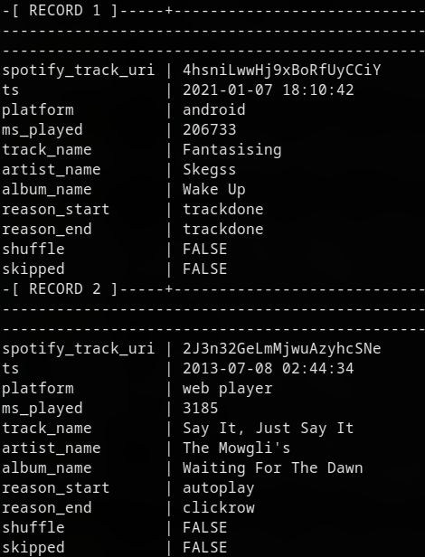

# 📦 Projeto Final — Montando o Data Lake de Dados

## 🧱 Preparando o Ambiente com Docker

Para iniciarmos, precisamos subir dois containers: **MongoDB** e **PostgreSQL**. Para isso, adicione os serviços abaixo no seu arquivo `docker-compose.yml`:

```yaml
  mongo:
    image: mongo:6.0
    container_name: ${STACK_NAME}-mongo
    hostname: mongo
    ports:
      - "27017:27017"
    command: ["mongod", "--replSet", "rs0", "--bind_ip_all"]
    volumes:
      - mongo_data:/data/db
    networks:
      - ${STACK_NAME}_network
    healthcheck:
      test: ["CMD", "mongosh", "--eval", "db.adminCommand('ping')"]
      interval: 10s
      timeout: 10s
      retries: 5

  postgres:
    image: postgres:15
    container_name: ${STACK_NAME}-postgres
    hostname: postgres
    ports:
      - "5432:5432"
    environment:
      POSTGRES_USER: ${POSTGRES_USER}
      POSTGRES_PASSWORD: ${POSTGRES_PASSWORD}
      POSTGRES_DB: ${POSTGRES_DB}
    command: ["postgres", "-c", "wal_level=logical", "-c", "max_replication_slots=10", "-c", "max_wal_senders=10"]
    volumes:
      - postgres_data:/var/lib/postgresql/data
    networks:
      - ${STACK_NAME}_network
    healthcheck:
      test: ["CMD", "pg_isready", "-U", "${POSTGRES_USER}"]
      interval: 10s
      timeout: 5s
      retries: 5
```

> **Importante:** Adicione as variáveis de ambiente `POSTGRES_USER`, `POSTGRES_PASSWORD` e `POSTGRES_DB` no seu arquivo `.env`.

Para subir os containers:

```bash
docker compose up -d
```

---

## 📁 Carregando Dados no HDFS

Para salvar os dados dos arquivos `.csv` e `.json` nos bancos, primeiro colocamos esses arquivos no **HDFS**, através da pasta `myfiles` (volume compartilhado entre o host e o container).

Acesse o container do Spark Master:

```bash
docker exec -it spark-master bash
```

Dentro do container, navegue até a pasta:

```bash
cd myfiles/
```

Exemplo de arquivos disponíveis:

```bash
myuser@spark-master:~/myfiles$ ls
README.md              spotify_history.csv       write_data_postgress.ipynb
spark-streaming.ipynb  write_data_mongodb.ipynb
```

Agora coloque os arquivos no HDFS:

```bash
hdfs dfs -put spotify_history.csv
hdfs dfs -ls
```

Saída esperada:

```
Found 6 items
...
-rw-r--r--   2 myuser supergroup   21329900 2025-07-19 20:53 spotify_history.csv
```

---

## 🚀 Aplicações Spark para Escrita dos Dados

### 1️⃣ Escrevendo no PostgreSQL

Use a aplicação Spark:

> 🔗 [`write_data_postgress.ipynb`](./notebooks/write_data_postgress.ipynb)

Ao executar este notebook, os dados do arquivo `spotify_history.csv` serão salvos no banco PostgreSQL, rodando no container `spark-postgres`.

Verificando os dados:

```bash
docker exec -it spark-postgres bash
psql -U postgres -d spark-db
```

No shell do Postgres:

```sql
\x
SELECT * FROM music;
```

<p align="center">
  
</p>

---

### 2️⃣ Escrevendo no MongoDB

Para isso, utilize o notebook:

> 🔗 `write_data_mongodb.ipynb` (em construção)

Antes de rodar, **crie o banco e a collection** manualmente:

```bash
docker exec -it spark-mongo mongosh
```

Dentro do Mongo:

```js
rs.initiate()
use <nome_do_banco>
db.createCollection("<nome_da_colecao>")
```

> ⚠️ **Importante:** esses nomes devem coincidir com os usados no notebook Spark.

---

## 🐘 Configurando o Kafka

### Passos para iniciar o Kafka:

1. Acesse o container `spark-master`.
2. Instale o Kafka.
3. Edite o arquivo `$KAFKA_HOME/config/kraft/server.properties`.
4. Gere um Cluster ID:

```bash
export KAFKA_CLUSTER_ID="$(kafka-storage.sh random-uuid)"
```

5. Formate o diretório de logs:

```bash
kafka-storage.sh format -t $KAFKA_CLUSTER_ID -c $KAFKA_HOME/config/kraft/server.properties
```

6. Crie o tópico Kafka:

```bash
kafka-topics.sh --create --topic music --bootstrap-server spark-master:9092
```

7. Inicie o servidor Kafka:

```bash
kafka-server-start.sh $KAFKA_HOME/config/kraft/server.properties
```

Se tudo estiver correto, você verá no log:

```
[INFO KafkaRaftServer nodeId=1] Kafka Server started (kafka.server.KafkaRaftServer)
```

---

## 🔌 Configurando o Debezium (Kafka Connect)

### Conector MongoDB

1. Instale o conector Debezium para MongoDB.
2. Ajuste o arquivo `connect-standalone.properties`.
3. Inicie o Kafka Connect:

```bash
connect-standalone.sh $KAFKA_HOME/config/connect-standalone.properties
```

Se der certo, aparecerá:

```
[INFO Kafka Connect started (org.apache.kafka.connect.runtime.Connect:77)]
```

4. Crie o arquivo `mongoc.json`:

```json
{
  "name": "mongo-connector", 
  "config": {
    "connector.class": "io.debezium.connector.mongodb.MongoDbConnector",
    "tasks.max": "1",
    "mongodb.hosts": "rs0/mongo:27017", 
    "mongodb.connection.string": "mongodb://mongo:27017/?replicaSet=rs0",
    "mongodb.name": "mongosrv",
    "topic.prefix": "topico-mongo",
    "database.include.list": "spark-db", 
    "collection.include.list": "spark-db.music",
    "mongodb.ssl.enabled": "false"
  }
}
```

5. Registre o conector:

```bash
curl -X POST -H "Content-Type: application/json" \
  --data @/home/myuser/kafka/connect/debezium-connector-mongodb/mongoc.json \
  http://spark-master:8083/connectors
```

6. Verifique o status:

```bash
curl http://spark-master:8083/connectors/mongo-connector/status
```

Saída esperada:

```json
{
    "name":"mongo-connector",
    "connector":{
        "state":"RUNNING",
        "worker_id":"172.31.0.2:8083"
    },
    "tasks":[{
        "id":0,
        "state":"RUNNING",
        "worker_id":"172.31.0.2:8083"
    }],
    "type":"source"
}
```

---

### Conector PostgreSQL

1. Crie o arquivo `postgressc.json`:

```json
{
 "name": "postgres-connector",
  "config": {
    "connector.class": "io.debezium.connector.postgresql.PostgresConnector",
    "database.hostname": "spark-postgres",
    "database.server.name": "spark-postgres",
    "database.port": "5432",
    "database.user": "postgres",
    "database.password": "postgres123",
    "database.dbname" : "spark-db",
    "plugin.name": "pgoutput",
    "topic.prefix": "music",
    "table.whitelist": "music",
    "value.converter": "org.apache.kafka.connect.json.JsonConverter"
  }
}
```

2. Registre o conector:

```bash
curl -X POST -H "Content-Type: application/json" \
  --data @/home/myuser/kafka/connect/debezium-connector-postgres/postgresc.json \
  http://spark-master:8083/connectors
```

3. Verifique o status:

```bash
curl http://spark-master:8083/connectors/postgres-connector/status
```

Saída esperada:

```json
{
  "name": "postgres-connector",
  "connector": {
    "state": "RUNNING",
    "worker_id": "172.31.0.2:8083"
  },
  "type": "source"
}
```

---

## ⚙️ Processamento dos Dados e Armazenamento dos Dados

todo o processamento e armazenamento estão descritos no [notebook](./notebooks/trabalho_final.ipynb) 