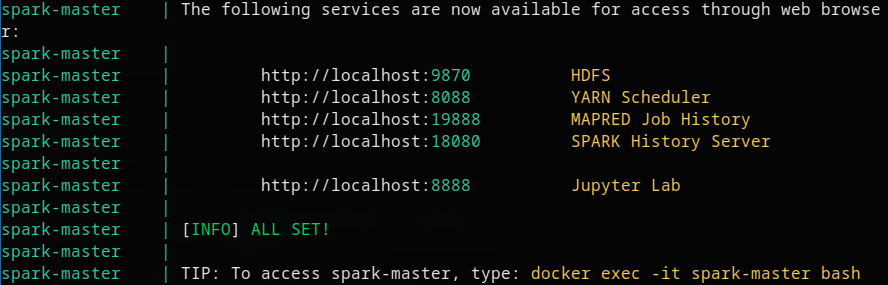

# Usando RDD no PySpark

## 📊 Contagem de Funcionários por Cargo com PySpark (RDD)

Este projeto tem como objetivo aplicar conceitos de RDD (Resilient Distributed Dataset) do PySpark para processar uma folha de pagamento de funcionários de uma empresa. O dataset utilizado foi o `conjunto2.csv`.

A tarefa principal é identificar a quantidade de pessoas por cargo, garantindo a remoção de duplicatas e sem utilizar *DataFrames*, apenas RDDs.

### 🧠 Objetivo

* Ler um conjunto de dados CSV contendo nomes e cargos de funcionários.
* Remover duplicatas no dataset.
* Contar a quantidade de pessoas por cargo.
* Utilizar exclusivamente RDDs no processamento.

---

### 🗃️ Dataset

O conjunto de dados utilizado nesta aplicação está disponível em:
**[https://goo.gl/A3MhFS](https://goo.gl/A3MhFS)**
Arquivo: `conjunto2.csv`

---

### ⚙️ Tecnologias

* Python 3
* Apache Spark (PySpark)
* Hadoop (via Docker)
* RDDs (sem uso de DataFrames)
* Ambiente distribuído simulado com Docker

---

### 🚀 Como Executar

Siga os passos abaixo para executar a aplicação localmente utilizando o ambiente preparado pelo professor Viegas:

#### 1. Clonar o repositório

```bash
git clone https://github.com/cmdviegas/hadoop-spark.git
cd hadoop-spark
```

#### 2. Baixar os dados e dependências

```bash
./download.sh
```

#### 3. Construir os containers

```bash
docker compose build
```

#### 4. Iniciar o ambiente Spark

```bash
docker compose up -d
```

#### 5. Acessar o container e executar o script PySpark

No terminal, acesse o container Spark com:

```bash
docker exec -it spark-master bash
```

Dentro do container, voce pode adicionar o arquivo pelo HDFS ou deixar dentro do container colocando no volume `myfiles`.

quando o cluster subir voce poderá acessar os seguintes links de apoio:



---

### 🧾 Código Principal (Resumo)

```python
from pyspark.sql import SparkSession

spark = (
    SparkSession.builder
        .master("yarn")
        .appName("People Count")
        .getOrCreate()
)

rdd = spark.sparkContext.textFile("file:///home/myuser/myfiles/conjunto2.csv")
head = rdd.first()
dados = rdd.filter(lambda linha: linha != head)

dados_processados = dados.map(lambda linha: linha.split(",")) \
                         .map(lambda campos: (campos[0], campos[1]))

resultado = dados_processados.sortBy(lambda x: x[1]) \
                             .distinct() \
                             .map(lambda x: (x[1], 1)) \
                             .reduceByKey(lambda a, b: a + b) \
                             .collect()
```